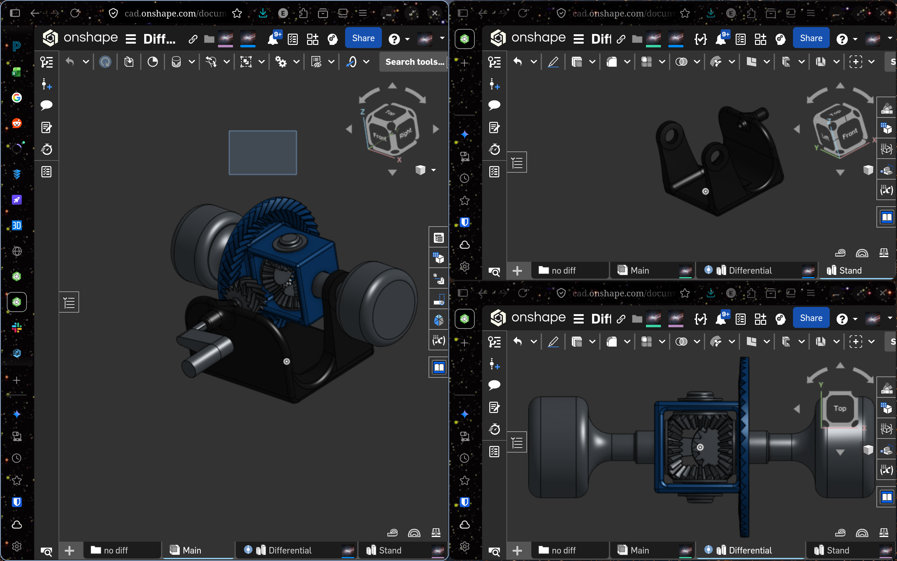
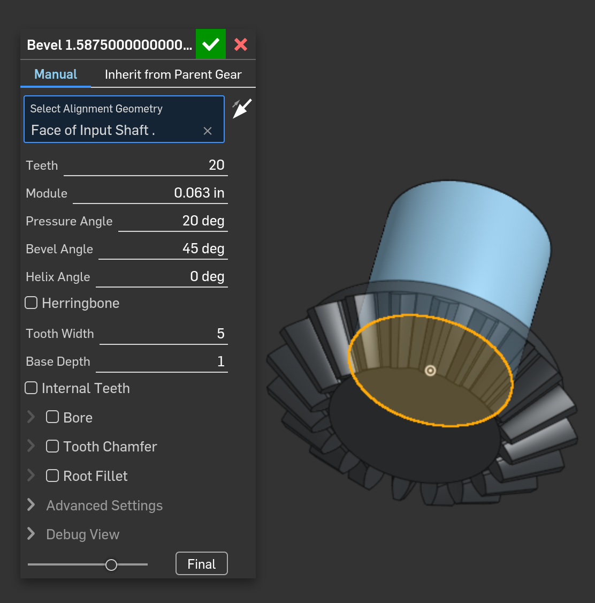
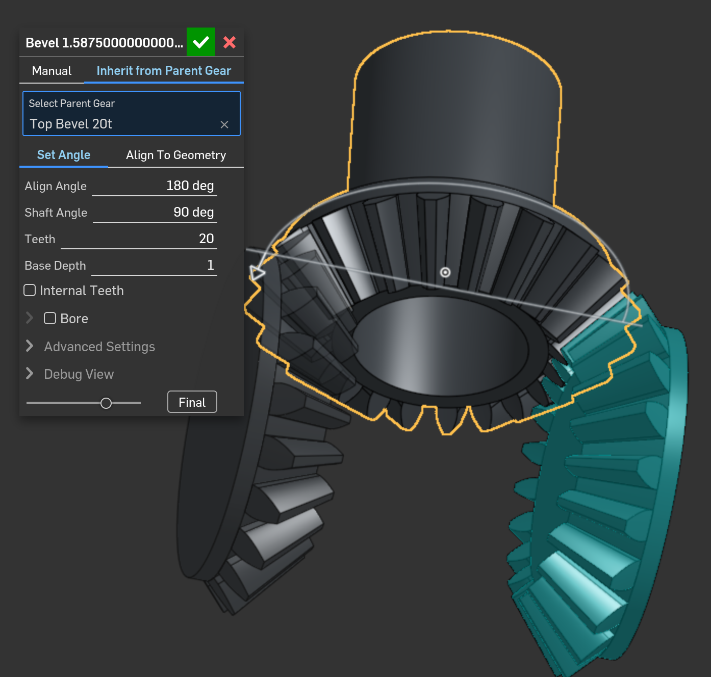

## It all starts with a model.

<iframe width="640" height="480" style="border:1px solid #eeeeee;" src="https://3dviewer.net/embed.html#model=https://raw.githubusercontent.com/ewb-lhs/ewb-lhs.github.io/refs/heads/master/3d/AAApip%20fix%201.step$camera=-27.57080,-378.45321,118.69615,-0.79375,-21.95681,52.63668,0.00000,1.00000,0.00000,45.00000$projectionmode=perspective$envsettings=fishermans_bastion,off$backgroundcolor=0,0,0,255$defaultcolor=200,200,200$defaultlinecolor=100,100,100$edgesettings=on,255,255,255,1"></iframe>
Self-Designed 3d Model --- Fully Designed and Contructed by Elliott Weston Ball
---

|#|Table of Contents|
|:---|:---:|
|1|[Research](#research-more-on-inspiration)|
|2|[Design](#computer-aided-design)|
|2.5|[Slicing](#slicing)|
|3|[Printing, Assembly and Mistakes](#printing-assembly-and-mistakes)|

---

### Research, more on [/Inspiration](./2026-5-27-Inspiration.md)
The first step I took after deciding to make this was to look online for more details. I used these to gain a better understanding of how a differential works, and how I could make one.

Source: ResearchGate

Source: MIT

### Computer Aided Design

After this I started on my model. I used a 3d design software called OnShape for this process. I used OnShape because I have free access to it's full featureset through robotics (see in the multipurpose room), and I am familiar with the layout.

I used scripting to generate the gears, this reduced the complication. All of the tolerances, gear spacing, angle, size, ratio, etc. was all automated so I could focus on creation.

---
I started with just a single gear:

---
I could then work from their and make other gears based on the original. This allowed me to make sure every gear was at a 90 degree angle and would line up.

---
I then slowly built a box around the inner gears

### Slicing
## Printing, Assembly, and Mistakes