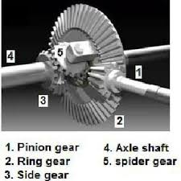
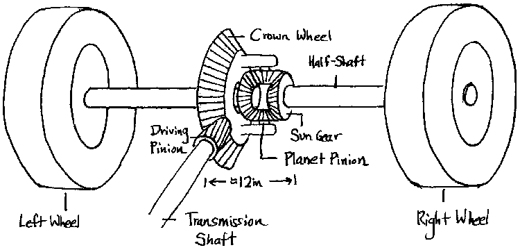

## It all starts with a model.

<iframe width="640" height="480" style="border:1px solid #eeeeee;" src="https://3dviewer.net/embed.html#model=https://raw.githubusercontent.com/ewb-lhs/ewb-lhs.github.io/refs/heads/master/3d/AAApip%20fix%201.step$camera=-27.57080,-378.45321,118.69615,-0.79375,-21.95681,52.63668,0.00000,1.00000,0.00000,45.00000$projectionmode=perspective$envsettings=fishermans_bastion,off$backgroundcolor=0,0,0,255$defaultcolor=200,200,200$defaultlinecolor=100,100,100$edgesettings=on,255,255,255,1"></iframe>
Self-Designed 3d Model --- Fully Designed and Contructed by Elliott Weston Ball

---

The first step I took after deciding to make this was to look online for more details.

Source: ResearchGate

Source: MIT